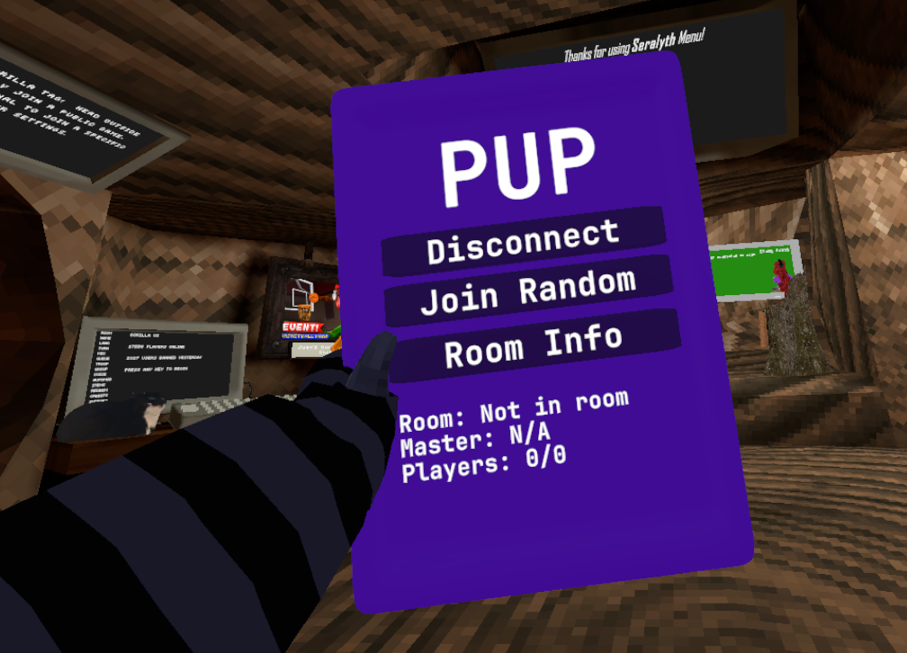

# 📱 PUP (Pasta's Utils Tablet)

A simple Gorilla Tag utility mod that adds a custom in-game tablet packed with useful tools and quality-of-life features.

## Preview

## Features

- 📱 Custom in-game utility tablet
- ⚡ Lightweight and optimized
- 🎨 Clean, modern interface
- 🛠️ Useful quality-of-life utilities
- 📦 Easy to install

## Installation

1. Download the latest release from the **Releases** page.
2. Place the `.dll` into your **Gorilla Tag/BepInEx/plugins** folder.
3. Launch Gorilla Tag.
4. Open the **PUP** tablet and enjoy!

## Notes

PUP is primarily a client-side utility mod designed for convenience and fun. It does not modify Gorilla Tag's core gameplay or provide unfair advantages. Some features may require other players to have the mod installed in order to work.

## Credits

**Developer:** Pasta

## Issues

Found a bug or have an idea for a new feature? Feel free to open an issue on GitHub or contact me on Discord **(@pastapluh)**.

Have fun! 📱💜

---

### Disclaimer

Gorilla Tag and all related names, logos, assets, and trademarks are the property of Another Axiom LLC. This project is an unofficial fan-made mod and is distributed for personal, non-commercial use only. If requested by the rights holders, this project or any of its assets will be modified or removed.
